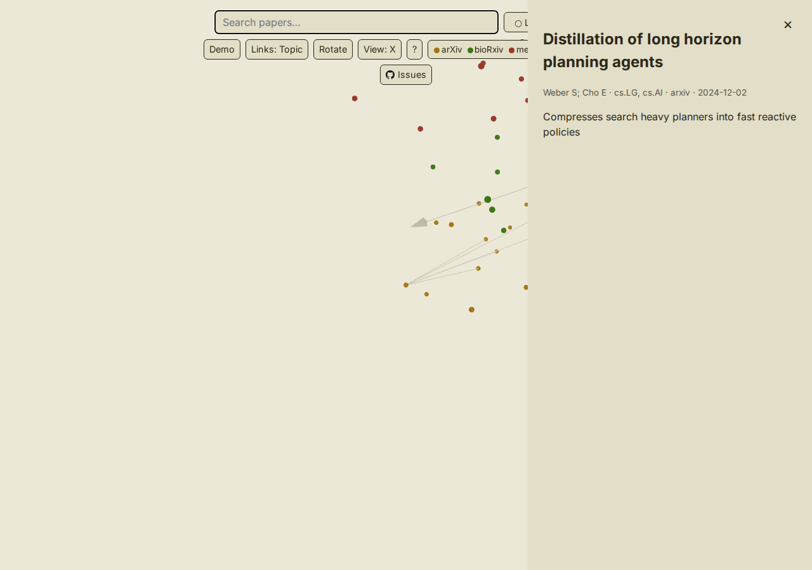

# paperverse

> A navigable 3D cloud of arXiv, bioRxiv, and medRxiv papers — for researchers tracing
> connections across fields, right in the browser.

[](LICENSE)
[](docs/roadmap.md)
[](https://github.com/qte77/paperverse/actions/workflows/codeql.yaml)
[](https://www.codefactor.io/repository/github/qte77/paperverse)
[](https://github.com/qte77/paperverse/actions/workflows/validate.yml)
[](https://github.com/qte77/paperverse/actions/workflows/lint-md-links.yml)

## What

A 3D point cloud of arXiv, bioRxiv, and medRxiv papers, explored entirely in the browser:

- Papers placed by **topic** (x/y) and **publication date** (depth) — clusters and eras read at a glance
- **Hover** for a title, **click** for full metadata (authors, source, date, abstract)
- **Full-text search** that highlights matches and flies the camera to them
- **Neighbour links** with a topic/time toggle — related work across fields, or within a period
- **Pause** rotation and **snap** to axis-aligned views for a fixed orientation
- **Light/dark** theme, depth cues, and a source colour legend
- Served from a **static site** — no server, no install

How it's built (ingest → UMAP layout → SQLite + FTS5 export) is in
[docs/architecture.md](docs/architecture.md).

<details>
<summary>Screenshot — 3D paper cloud</summary>

<picture>
  <source media="(prefers-color-scheme: dark)" srcset="assets/images/cloud-dark.png" />
  
</picture>

</details>

## How

**Explore** — open the [live demo](https://qte77.github.io/paperverse/) (zero setup), or
build and serve the UI locally:

```bash
make preview   # build the UI and serve it at http://localhost:8143
```

**Run the pipeline** — requires Python 3.12+ and [uv](https://docs.astral.sh/uv/):

```bash
uv sync
uv run paperverse --data-dir data --output dist/data   # -> papers.db, positions.bin, meta.json
```

Full flags and the input CSV format: [docs/usage.md](docs/usage.md).

> paperverse is an internal pipeline tool, not a published library — there is no
> `pip install paperverse` or public API. Use the `paperverse` CLI above, or the hosted UI.

**Develop** — setup, the full test loop, and the branch/PR workflow are in
[CONTRIBUTING.md](CONTRIBUTING.md).

## Why

[Paperscape.org](https://paperscape.org) pioneered mapping the literature, but it shows
**arXiv only**, as a flat **2D** tiled grid on a dated stack — no 3D, no other sources. So
researchers working across domains (e.g. ML + neuroscience) can't see relationships that span
arXiv, bioRxiv, and medRxiv. **paperverse is different**: it unifies all three sources in a
single navigable **3D** cloud (topic on x/y, publication date on z) served from a static
site, making cross-domain and temporal patterns visible. More in
[docs/UserStory.md](docs/UserStory.md) and [docs/PRD.md](docs/PRD.md).

## Refs

- [architecture.md](docs/architecture.md) — how it's built
- [ADR-0001](docs/decisions/0001-backend-cli-ui-separation.md) — the four-layer separation
- [ADR-0002](docs/decisions/0002-in-browser-store-and-data-contract.md) — SQLite + FTS5 in
  the browser (over DuckDB-WASM / Parquet) and the export data contract
- [roadmap.md](docs/roadmap.md) — what shipped and what's next
- [CONTRIBUTING.md](CONTRIBUTING.md) — principles, testing, and the branch/PR workflow

## License

Apache-2.0 — see [LICENSE](LICENSE). Third-party components bundled in the web UI
(three.js and sql.js-fts5 under MIT, the Inter font under the SIL OFL 1.1) are
attributed in [NOTICE](NOTICE).
