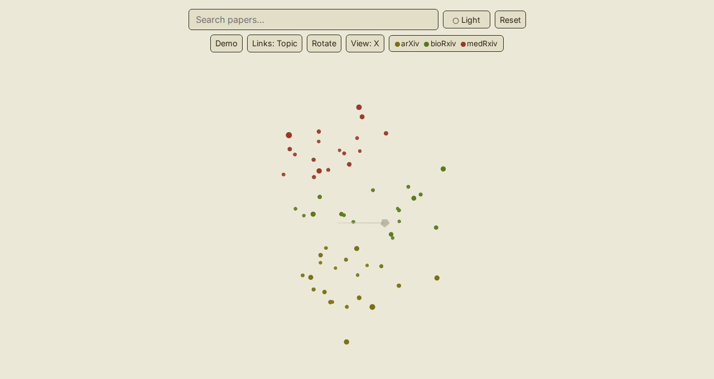

# paperverse

> A navigable 3D cloud of arXiv, bioRxiv, and medRxiv papers — for researchers tracing
> connections across fields, right in the browser.

[](LICENSE)
[](docs/roadmap.md)
[](https://github.com/qte77/paperverse/actions/workflows/codeql.yaml)
[](https://www.codefactor.io/repository/github/qte77/paperverse)
[](https://github.com/qte77/paperverse/actions/workflows/validate.yml)
[](https://github.com/qte77/paperverse/actions/workflows/lint-md-links.yml)

## What

A 3D academic-paper cloud over arXiv, bioRxiv, and medRxiv. A Python pipeline ingests
weekly canonical CSVs, lays papers out in 3D with UMAP (topic on x/y, publication date on
z), and exports a SQLite + FTS5 database, a Float32 positions binary, and a small
`meta.json` sidecar; a Three.js + sql.js frontend renders and searches the cloud entirely
in the browser. What you get: a 3D point cloud with hover/click detail, full-text search, a
theme picker, depth cues, neighbour links with a topic/time toggle, pause + axis-snap views,
and a source legend.

<details>
<summary>Screenshot — 3D paper cloud</summary>

<picture>
  <source media="(prefers-color-scheme: dark)" srcset="docs/img/cloud-dark.png" />
  
</picture>

</details>

## How

**Explore** — open the [live demo](https://qte77.github.io/paperverse/) (zero setup), or
build and serve the UI locally:

```bash
make preview   # build the UI and serve it at http://localhost:8143
```

**Run the pipeline** — requires Python 3.12+ and [uv](https://docs.astral.sh/uv/):

```bash
uv sync
uv run paperverse --data-dir data --output dist/data   # -> papers.db, positions.bin, meta.json
```

`--data-dir` holds one subdirectory per source, each with canonical CSVs
(`Date,ISOWeek,DOI,Version,Category,Title,Authors,Abstract`):

```text
data/
  arxiv/.../*.csv
  biorxiv/.../*.csv
  medrxiv/.../*.csv
```

| Flag | Default | Description |
| --- | --- | --- |
| `--data-dir` | `data` | Root holding one CSV subdirectory per source |
| `--output` | `dist/data` | Directory to receive `papers.db`, `positions.bin`, and `meta.json` |
| `--sources` | all | Restrict to sources; repeatable (`--sources arxiv --sources biorxiv`) |
| `--seed` | `42` | UMAP seed for reproducible layouts |

> paperverse is an internal pipeline tool, not a published library — there is no
> `pip install paperverse` or public API. Use the `paperverse` CLI above, or the hosted UI.

**Develop** — the full local loop:

```bash
make setup      # uv sync + lychee + markdownlint-cli2
make validate   # ruff + pyright (strict) + markdownlint + pip-audit + pytest (cov >= 90%)
make test       # fast pytest (red-green-refactor loop)
make test_js    # ui/ vitest
```

Run `make help` for all recipes.

## Why

Paperscape.org maps arXiv as a flat 2D tiled grid — arXiv only, a dated stack, no 3D.
Researchers working across domains (e.g. ML + neuroscience) can't see cross-source
relationships between arXiv, bioRxiv, and medRxiv. paperverse unifies all three in one
navigable 3D space so cross-domain and temporal patterns become visible. More in
[docs/UserStory.md](docs/UserStory.md) and [docs/PRD.md](docs/PRD.md).

## Refs

Four layers with one-way imports (`L4 → L1`): **L1** backend (`src/paperverse/`) — the
`Paper` model, CSV ingest, UMAP layout, and the SQLite + positions export (ships in the
wheel); **L2** the `paperverse` CLI; **L4** a static Three.js + sql.js UI (`ui/`,
Vite-built, not in the wheel).

- [architecture.md](docs/architecture.md) — how it's built
- [ADR-0001](docs/decisions/0001-backend-cli-ui-separation.md) — the four-layer separation
- [ADR-0002](docs/decisions/0002-in-browser-store-and-data-contract.md) — SQLite + FTS5 in
  the browser (over DuckDB-WASM / Parquet) and the export data contract
- [roadmap.md](docs/roadmap.md) — what shipped and what's next
- [CONTRIBUTING.md](CONTRIBUTING.md) — principles, testing, and the branch/PR workflow

## License

Apache-2.0 — see [LICENSE](LICENSE). Third-party components bundled in the web UI
(three.js and sql.js-fts5 under MIT, the Inter font under the SIL OFL 1.1) are
attributed in [NOTICE](NOTICE).
